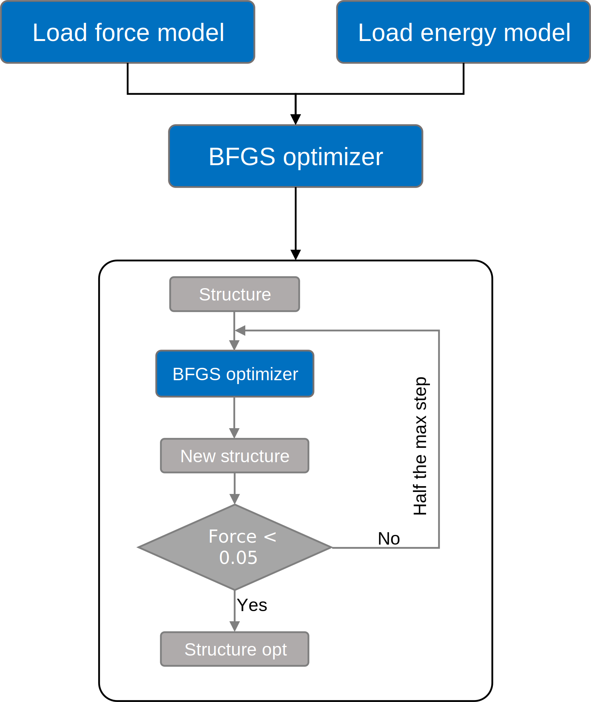
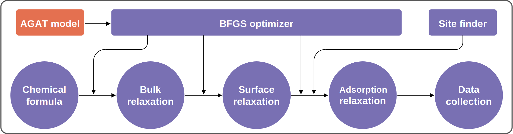

# **AGAT for High-Entropy Catalysis**
### This is the manual to reproduce  results and support conclusions of [***Design High-Entropy Electrocatalyst via Interpretable Deep Graph Attention Learning***](url).   
We recommend using a Linux operating system to run the following examples.  <br>    <br>


# Table of Contents
- [Install dependencies](#install-dependencies)  
- [Example of using this code](#example-of-using-this-code)   
  - [Prepare VASP calculations](#prepare-VASP-calculations)  
  - [Collect paths of VASP calculations](#collect-paths-of-VASP-calculations)  
  - [Build graphs](#build-graphs)  
  - [Train](#train)  
  - [Check training results](#check-training-results)   
  - [Predict](#predict)  
  - [High-throughput predict](#high-throughput-predict)  

- [Data for Figures](#data-and-code-for-figures) in *[reference](url)*
  - [Figure 2](#figure-2)
  - [Figure 3](#figure-3)
  - [Figure 4](#figure-4)
  - [Figure 5](#figure-5)
  - [Figure 7](#figure-7)

# Install dependencies
**Requirements file:** [requirements.txt](requirements.txt)

**Key modules**
```
dgl-cu110
numpy==1.19.5
scikit-learn==0.24.2
tensorflow==2.5.0
tensorflow-gpu==2.4.0
```
# Example of using this code
### Prepare VASP calculations
- Bulk optimization: orientation of z axis: [111]   
  The atomic positions, cell shape, and cell volume are freely relaxed.  
  
- Cleave surface: insert vacuum space along z.  
  Code: [add_vacuum_space.py](tools/add_vacuum_space.py)  
  See the [code documentation](docs/add_vacuum_space.md).  
  
- Relax the surface model.  
  Volume and shape of the surpercell is fixed.  
  
- Add adsorbate(s)  
  Code: [generate_adsorption_sites_ase.py](tools/generate_adsorption_sites_ase.py)   
  See the [code documentation](docs/generate_adsorption_sites_ase.md).  
  
- Copy generated structural file into individual folders, and run VASP.  

### Collect paths of VASP calculations   
- Find all directories containing `OUTCAR` file:   
  ```
  find . -name OUTCAR > paths.log
  ```    
- Remove the string 'OUTCAR' in `paths.log`.   
  ```
  sed -i 's/OUTCAR$//g' paths.log
  ```   

### Collect frames based on `paths.log`.  
- Code: [split_POSCAR_forces_from_vaspout_parallel.py](tools/split_POSCAR_forces_from_vaspout_parallel.py)    
- Usage: python + split_POSCAR_forces_from_vaspout_parallel.py + paths_file + dataset_path + number of cores   
- For example:  
  ``` 
  python split_POSCAR_forces_from_vaspout_parallel.py paths.log $PWD/dataset 8 # run parallelly with 8 cores.
  ```  

  - Outputs:   
  Under the `dataset` directory, four types of files are generated.
    - `fname_prop_*.csv`: `csv` files with three columns: file names of output frames, energy per atom, absolute path. `*` is the wildcard.   
    - `fname_prop.csv`: a `csv` file including all above files.  
    - `POSCAR_*_*_*`: `POSCAR` files seprated from VASP calculations. `*` is the wildcard.   
    - `POSCAR_*_*_*_force.npy`: `numpy.array` of forces. `*` is the wildcard.    

### Build graphs   
- Code: [Crystal2Graph.py](modules/Crystal2Graph.py)  
- Example:   
  ```
  from modules.Crystal2Graph import ReadGraphs
  import os
  if __name__ == '__main__':
      graph_reader = ReadGraphs('fname_prop.csv', # csv file generated above.
                                'dataset', # directory contain all frames
                                cutoff       = None, # We don't need this for 'ase_natural_cutoffs'.
                                mode_of_NN   = 'ase_natural_cutoffs', # identify connection between atoms with 'ase_natural_cutoffs'
                                from_binary  = False, # read from structural files
                                num_of_cores = 8, # run parallelly with 8 cores.
                                super_cell   = False # do not repeat cell for small supercells.)

      graph_list, graph_labels = graph_reader.read_all_graphs(scale_prop=False, # do not rescale the label.
                                                              ckpt_path=os.path.join('project', 'ckpt') # save the information of how to build the graphs.)
  ```   
  - Output files:
    - `all_graphs.bin`: binary file of graphs, can be read by `DGL`.  
    - `graph_build_scheme.json`: a `json` file storing the graph construction information.

### Train   
- Prepare files   
  - Creat a folder by running:   
    ```
    mkdir project
    mkdir -p project/dataset
    mkdir -p project/files  
    ```   
  - Copy files generated by above steps  
    ```
    cp all_graphs.bin project/dataset/
    cp fname_prop.csv project/files/
    ```
  
  - File structure before training:  
    ```  
    project
    ├── dataset
    │   └── all_graphs.bin
    └── files
        └── fname_prop.csv
    ```  
  
- Train the energy model  
  - Code: [energy_main.py](energy_main.py)   
  - Modify energy model [parameters](energy_main.py/#L23-L58).  
  
- Train the force model  
  - Code: [force_main.py](force_main.py)   
  - Modify force model [parameters](force_main.py/#L24-L62).  

- Run:   
  ```
  python energy_main.py
  python force_main.py
  ```  
  
  
### Check training results   
  - File structure after training:
    ```  
    project
    ├── dataset
    │   └── all_graphs.bin
    ├── energy_ckpt
    │   ├── checkpoint
    │   ├── gat.ckpt.data-00000-of-00001
    │   ├── gat.ckpt.index
    │   ├── gat_model.json
    │   ├── graph_build_scheme.json
    │   └── graph_tmp.bin
    ├── files
    │   ├── fname_prop.csv
    │   ├── test.txt
    │   ├── train.txt
    │   └── validation.txt
    ├── force_ckpt
    │   ├── checkpoint
    │   ├── gat.ckpt.data-00000-of-00001
    │   ├── gat.ckpt.index
    │   ├── gat_model.json
    │   ├── graph_build_scheme.json
    │   └── graph_tmp.bin
    └── log
        ├── en_test_final_pred.txt
        ├── en_test_final_true.txt
        ├── en_train_pred.txt
        ├── en_train_true.txt
        ├── en_val_final_pred.txt
        ├── en_val_final_true.txt
        ├── en_val_pred.txt
        ├── en_val_true.txt
        ├── force_test_final_pred.txt
        ├── force_test_final_true.txt
        ├── force_train_pred.txt
        ├── force_train_true.txt
        ├── force_val_final_pred.txt
        ├── force_val_final_true.txt
        ├── force_val_pred.txt
        └── force_val_true.txt
    ```    
    
- Energy model performance  
  Check the final mean absolute error:  
  ```
  tail -5 v7_energy.log  
  ```
  Output:   
  ```
  User log: model summary:
  User log: model summary done.
  User log: predict MAE: 0.0055
  User log: predict MAE: 0.0055
  User log: Total time: 76705.56
  ```  
  
  
- Force model performance   
  Check the final mean absolute error:  
  ```
  tail -5 v7_force.log
  ```
  Output:   
  ```
  User log: model summary:
  User log: model summary done.
  User log: Final predict MAE of test set is: 0.0853
  User log: Final predict MAE of validation set is: 0.0853
  User log: Total time: 175838.12
  ```  

- Get the data for *True vs. Predicted* plot:  
  Check out these files:  
  - `project/log/en_test_final_pred.txt`  
  - `project/log/en_test_final_true.txt`  
  - `project/log/force_test_final_pred.txt`  
  - `project/log/force_test_final_true.txt`  


- After training, the well-trained models are stored at:   
  - `project/energy_ckpt`  
  - `project/force_ckpt`    

### Predict   
- Code: `[GatAseCalculator](tools/GatApp.py#L135-L165)`
- Prepare a structural file. For example: [POSCAR_0_0](files/POSCAR_0_0).  
- Run:   
  ```
  from GatApp import GatAseCalculator # self-defined calculator including AGAT model.
  from ase.optimize import BFGS
  from ase.io import read, write
  
  energy_model_save_dir = os.path.join('project', 'energy_ckpt') # well-trained energy model
  force_model_save_dir  = os.path.join('project', 'force_ckpt') # well-trained force model
  calculator=GatAseCalculator(energy_model_save_dir, force_model_save_dir, gpu=-1) # instantiate a ase calclulator
  
  config = {'fmax'             : 0.1,  # force convergence criteria
             'steps'            : 200, # max iteration steps
             'maxstep'          : 0.05, # relaxation step size
             'restart'          : None,
             'restart_steps'    : 0,
             'perturb_steps'    : 0,
             'perturb_amplitude': 0.05}
  
  atoms = read('POSCAR_0_0') # read structural file
  dyn = BFGS(atoms,
             logfile='test.log',
             trajectory='test.traj',
             restart=config["restart"],
             maxstep=config["maxstep"])
  return_code  = dyn.run(fmax=config["fmax"], steps=config["steps"]) # optimize structure
  write('CONTCAR_0_0', atoms, format='vasp') # save the optimized structure.
  ```


### High-throughput predict   
- Integrated BFGS optimizer: More details about ASE [Optimizer](https://wiki.fysik.dtu.dk/ase/ase/optimize.html).     
      
- High-throughput prediction pipline.  
  
- Code: [high_throughput_predict.py](tools/high_throughput_predict.py)   
  This code needs [modules](modules) and [GatApp.py](tools/GatApp.py)   
- Well-trained model for energy and force prediction can be found at [files/NiCoFePdPtP_potential](files/NiCoFePdPtP_potential)  
- Specify the chemical formula at this [line](tools/high_throughput_predict.py#L325) of [high_throughput_predict.py](tools/high_throughput_predict.py)   
  For example: `formula = 'NiCoFePdPt'`  
- Run: `python high_throughput_predict.py`
- Outputs:   
  - `POSCAR_surf_opt_*.gat`: Optimized structures of clean surface. `*` is the wildcard.  
  - `ads_surf_energy_OOH_*.txt`: out data including three columns: `total energy of model with adsorbate`, `total energy of clean surface`, `error code of each calculation`. If the `error code` is `0.000000`, then this line should be discarded. `*` is the wildcard.   
  - `out.log`: The log file.  
  
# Data and code for figures
### Figure 2
### Figure 3
### Figure 4
### Figure 5
### Figure 7

## Example

