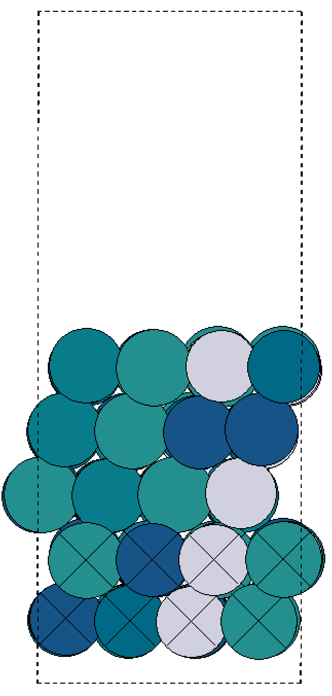

# Manual for [add_vacuum_space.py](../tools/add_vacuum_space.py)  

* Usage: python add_vacuum_space.py `structural file name` `number of atomic layers along z`  

* Structural file: [CONTCAR_bulk_example](../files/CONTCAR_bulk_example)  


* Change working directory to [AGAT/AGAT_CATA](../)  

* Run:  
```  
python tools\add_vacuum_space.py files\CONTCAR_bulk_example 6  
```  

* Output file: [CONTCAR_bulk_example_with_vacuum](../files/CONTCAR_bulk_example_with_vacuum).   

* The surface model:  



* Note:  
	* There are 6 atomic planes along z in [CONTCAR_bulk_example](../files/CONTCAR_bulk_example) file.
	* Atoms in the bottom plane will be removed by this code.  
	* Thickness of vacuum space: 10 Å.  
	* Bottom two atomic layers are fixed to their bulk positions.
