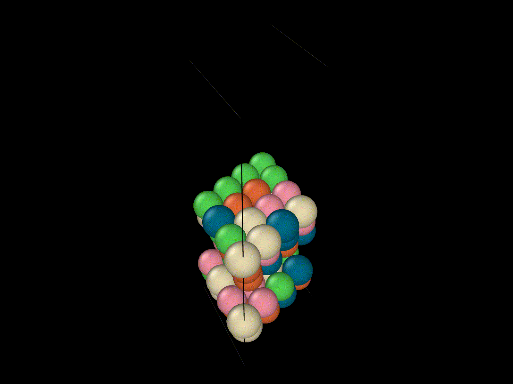
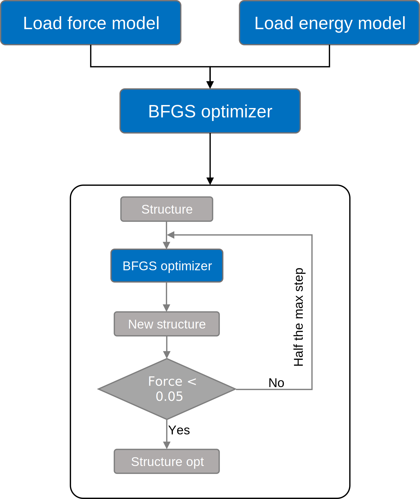
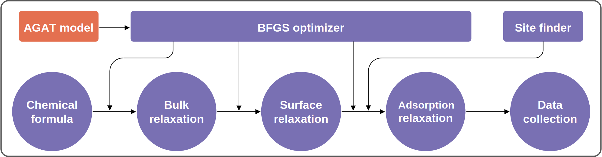

[](https://zenodo.org/badge/latestdoi/545430295)    

# AGAT
## Atomic Graph ATtention networks

#### This is the first version of AGAT model, which reproduces results and support conclusions of [***Design High-Entropy Electrocatalyst via Interpretable Deep Graph Attention Learning***](https://doi.org/10.1016/j.joule.2023.06.003)

# Turorial
### The [documentation](https://jzhang-github.github.io/AGAT/v1.0.0) of AGAT API is available.


We recommend using a Linux operating system to run the following examples, under the [current directory](.).  


# Table of Contents
- [Install dependencies](#install-dependencies)  
- [Example of using this code](#example-of-using-this-code)   
  - [Prepare VASP calculations](#prepare-VASP-calculations)  
  - [Collect paths of VASP calculations](#collect-paths-of-VASP-calculations)  
  - [Build graphs](#build-graphs)  
  - [Train](#train)  
  - [Check training results](#check-training-results)   
  - [Predict](#predict)  
  - [High-throughput predict](#high-throughput-predict)  

- [Example for figures](#example-for-figures) in [*reference*](https://doi.org/10.1016/j.joule.2023.06.003)
  - [Figure 2](#figure-2)
  - [Figure 3](#figure-3)
  - [Figure 4](#figure-4)
  - [Figure 5](#figure-5)

# Install dependencies
**Requirements file:** [requirements.txt](requirements.txt)

**Key modules**
```
dgl-cu110 (dgl.__version__ = '0.6.1')  
numpy==1.19.5
scikit-learn==0.24.2
tensorflow==2.5.0
tensorflow-gpu==2.4.0
ase==3.21.1
pymatgen==2020.11.11
```
# Example of using this code
### Prepare VASP calculations
- Bulk optimization: orientation of *z* axis: [111]   
  The atomic positions, cell shape, and cell volume are freely relaxed.  
  
- Cleave surface: insert vacuum space along z.  
  Code: [add_vacuum_space.py](tools/add_vacuum_space.py)  
  See the [code documentation](docs/add_vacuum_space.md).  
  
- Relax the surface model.  
  Volume and shape of the surpercell is fixed.  
  
- Add adsorbate(s)  
  Code: [generate_adsorption_sites_ase.py](tools/generate_adsorption_sites_ase.py)   
  See the [code documentation](docs/generate_adsorption_sites_ase.md).  
  
- Copy generated structural file into individual folders, and run VASP.  

### Collect paths of VASP calculations
- We provided examples of VASP outputs at [files/VASP_calculations_example](files/VASP_calculations_example).   
- Find all directories containing `OUTCAR` file:   
  ```
  find . -name OUTCAR > paths.log
  ```    
- Remove the string 'OUTCAR' in `paths.log`.   
  ```
  sed -i 's/OUTCAR$//g' paths.log
  ```   
- Specify the absolute paths in `paths.log`.   
  ```
  sed -i "s#^.#${PWD}#g" paths.log
  ``` 

### Collect frames based on `paths.log`.  

- Code: [tools/split_POSCAR_forces_from_vaspout_parallel.py](tools/split_POSCAR_forces_from_vaspout_parallel.py)    
- Usage: python + tools/split_POSCAR_forces_from_vaspout_parallel.py + paths_file + dataset_path + number of cores   
- For example:  
  ``` 
  python tools/split_POSCAR_forces_from_vaspout_parallel.py paths.log $PWD/files/dataset 8 # run parallelly with 8 cores.
  ```  

  - Outputs:   
  The [`files/dataset`](files/dataset) directory is created. Under the [`files/dataset`](files/dataset) directory, four types of files are generated:
    - `fname_prop_*.csv`: `csv` files with three columns: file names of output frames, energy per atom, absolute path. `*` is the wildcard.   
    - [`files/dataset/fname_prop.csv`](files/dataset/fname_prop.csv): a `csv` file including all `fname_prop_*.csv` files.  
    - `POSCAR_*_*_*`: `POSCAR` files seprated from VASP calculations. `*` is the wildcard.   
    - `POSCAR_*_*_*_force.npy`: `numpy.array` of forces, which should be read by `numpy` module. `*` is the wildcard.    

### Build graphs
- Prepare files  
  - Creat a folder by running:   
    ```
    mkdir project  
    mkdir -p project/dataset  
    mkdir -p project/files    
    ```   
    The [`project`](project) directory is used to store all files relevant to the following training.   
  
- Code: [Crystal2Graph.py](modules/Crystal2Graph.py)  
- Example:   

  ```   
  from modules.Crystal2Graph import ReadGraphs
  import os
  if __name__ == '__main__':
      graph_reader = ReadGraphs(os.path.join('files', 'dataset', 'fname_prop.csv'), # csv file generated above.
                                os.path.join('files', 'dataset'), # directory contain all frames
                                cutoff       = None, # We don't need this for 'ase_natural_cutoffs'.
                                mode_of_NN   = 'ase_natural_cutoffs', # identify connection between atoms with 'ase_natural_cutoffs'
                                from_binary  = False, # read from structural files
                                num_of_cores = 8, # run parallelly with 8 cores.
                                super_cell   = False) # do not repeat cell for small supercells.

      graph_list, graph_labels = graph_reader.read_all_graphs(scale_prop=False, # do not rescale the label.
                                                              ckpt_path='.') # save the information of how to build the graphs.

      train_index, validation_index, test_index = TrainValTestSplit(
          0.15, # validation_size: int or float. int: number of samples of the validation set. float: portion of samples of the validation set. 
          0.15, # test_size: int or float. int: number of samples of the validation set. float: portion of samples of the validation set. 
          os.path.join('files', 'dataset', 'fname_prop.csv'), # csv_file: str. File name of a csv file that contains the filenames of crystals.
          True)() # boolean. Split the dataset by `sklearn.model_selection.train_test_split` or loaded from previously saved txt files.
  ```    
 
  - Output files:
    - [`files/dataset/all_graphs.bin`](files/dataset/all_graphs.bin): binary file of graphs, can be read by `DGL` module.  
    - [`graph_build_scheme.json`](graph_build_scheme.json): a `json` file storing the graph construction information.  
    - [`files/dataset/test.txt`](files/dataset/test.txt): a text file contains the index of test set.  
    - [`files/dataset/train.txt`](files/dataset/train.txt): a text file contains the index of test set.  
    - [`files/dataset/validation.txt`](files/dataset/validation.txt): a text file contains the index of test set.  

### Train   
- Prepare files    
  - Copy files generated by above steps  
    ```
    cp files/dataset/all_graphs.bin project/dataset/
    cp files/dataset/fname_prop.csv project/files/
    cp files/dataset/{test.txt,train.txt,validation.txt} project/files 
    ```
  
  - File structure before training:  
    ```  
    project
    ├── dataset
    │   └── all_graphs.bin
    └── files
        ├── fname_prop.csv
        ├── test.txt
        ├── train.txt
        └── validation.txt
    ```  
  
- Train the energy model  
  - Code: [energy_main.py](energy_main.py)   
  - Modify energy model [parameters](energy_main.py#L23-L58).  
  
- Train the force model  
  - Code: [force_main.py](force_main.py)   
  - Modify force model [parameters](force_main.py#L24-L62).  

- Run:   
  ```
  python energy_main.py
  python force_main.py
  ```  
  - These scripts will use `GPU` card by default. You can modify [this line](energy_main.py/#L28) and [this line](force_main.py/#L29) as `gpu = -1`.    
  - Since only 10 calculations are included in the [files/VASP_calculations_example](files/VASP_calculations_example). The [`batch_size`](energy_main.py#L44), [`val_batch_size`](energy_main.py#L45), [`validation_freq`](energy_main.py#L47),  and [`validation_samples`](energy_main.py#L48) should be lowered to reasonable values if you want to train with the example dataset (not recommended). Same to train the [force model](force_main.py#L24-L62). If you have thousands (even more) frames of data points, the provided parameters are reasonable.     
  
### Check training results   
  - File structure of [`project`](project) after training:  
    ```  
    project
    ├── dataset
    │   └── all_graphs.bin
    ├── energy_ckpt
    │   ├── checkpoint
    │   ├── gat.ckpt.data-00000-of-00001
    │   ├── gat.ckpt.index
    │   ├── gat_model.json
    │   ├── graph_build_scheme.json
    │   └── graph_tmp.bin
    ├── files
    │   ├── fname_prop.csv
    │   ├── test.txt
    │   ├── train.txt
    │   └── validation.txt
    ├── force_ckpt
    │   ├── checkpoint
    │   ├── gat.ckpt.data-00000-of-00001
    │   ├── gat.ckpt.index
    │   ├── gat_model.json
    │   ├── graph_build_scheme.json
    │   └── graph_tmp.bin
    └── log
        ├── en_test_final_pred.txt
        ├── en_test_final_true.txt
        ├── en_train_pred.txt
        ├── en_train_true.txt
        ├── en_val_final_pred.txt
        ├── en_val_final_true.txt
        ├── en_val_pred.txt
        ├── en_val_true.txt
        ├── force_test_final_pred.txt
        ├── force_test_final_true.txt
        ├── force_train_pred.txt
        ├── force_train_true.txt
        ├── force_val_final_pred.txt
        ├── force_val_final_true.txt
        ├── force_val_pred.txt
        └── force_val_true.txt
    ```    
    
- Energy model performance  
  Check the final mean absolute error:  
  ```
  tail -5 v7_energy.log  
  ```
  Output:   
  ```
  User log: model summary:
  User log: model summary done.
  User log: predict MAE: 0.0055
  User log: predict MAE: 0.0055
  User log: Total time: 76705.56
  ```  
  
  
- Force model performance   
  Check the final mean absolute error:  
  ```
  tail -5 v7_force.log
  ```
  Output:   
  ```
  User log: model summary:
  User log: model summary done.
  User log: Final predict MAE of test set is: 0.0853
  User log: Final predict MAE of validation set is: 0.0853
  User log: Total time: 175838.12
  ```  

- Get the data for *True vs. Predicted* plot:  
  Check out these files:  
  - `project/log/en_test_final_pred.txt`  
  - `project/log/en_test_final_true.txt`  
  - `project/log/force_test_final_pred.txt`  
  - `project/log/force_test_final_true.txt`  


- After training, the well-trained models are stored at:   
  - `project/energy_ckpt`  
  - `project/force_ckpt`    

### Predict   
- Code: [`tools/GatAseCalculator`](tools/GatApp.py#L135-L165)
- Prepare a structural file. For example: [POSCAR_relax_example](files/POSCAR_relax_example).  
- We have provided the well-trained model at [`files/NiCoFePdPt_potential`](files/NiCoFePdPt_potential).  
- Run:   
  ```
  from tools.GatApp import GatAseCalculator # self-defined calculator including AGAT model.
  from ase.optimize import BFGS
  from ase.io import read, write
  import os
  
  energy_model_save_dir = os.path.join('files', 'NiCoFePdPt_potential', 'energy_ckpt') # well-trained energy model
  force_model_save_dir  = os.path.join('files', 'NiCoFePdPt_potential', 'force_ckpt') # well-trained force model
  calculator=GatAseCalculator(energy_model_save_dir, force_model_save_dir, gpu=-1) # instantiate a ase calclulator
  
  config = {'fmax'             : 0.1,  # force convergence criteria
             'steps'            : 200, # max iteration steps
             'maxstep'          : 0.05, # relaxation step size
             'restart'          : None,
             'restart_steps'    : 0,
             'perturb_steps'    : 0,
             'perturb_amplitude': 0.05}
  
  atoms = read(os.path.join('files', 'POSCAR_relax_example')) # read structural file
  atoms.set_calculator(calculator) # assign the AGAT calculator to atoms
  dyn = BFGS(atoms,
             logfile='test.log',
             trajectory='test.traj',
             restart=config["restart"],
             maxstep=config["maxstep"])
  return_code  = dyn.run(fmax=config["fmax"], steps=config["steps"]) # optimize structure
  write('CONTCAR_relax_example', atoms, format='vasp') # save the optimized structure.
  ```

- The structures is relaxed by the AGAT combined with `ase` [calculator](tools/GatApp.py#L135-L165):    

     
- Other outputs:  
  - `test.log`: pure text file.  
  - `test.traj`: trajectory file.  

### High-throughput predict   
- Integrated BFGS optimizer: More details about ASE [Optimizer](https://wiki.fysik.dtu.dk/ase/ase/optimize.html).     
      <br> <br>  
- High-throughput prediction pipline:     
  
- Code: [high_throughput_predict.py](tools/high_throughput_predict.py)   
  This code needs [modules](modules) and [GatApp.py](tools/GatApp.py)   
- Well-trained model for energy and force prediction can be found at [files/NiCoFePdPt_potential](files/NiCoFePdPt_potential)  
- Specify the chemical formula at this [line](tools/high_throughput_predict.py#L325) of [high_throughput_predict.py](tools/high_throughput_predict.py)   
  For example: `formula = 'NiCoFePdPt'`  

- Change directory to [`tools`](tools).  

- Run:   
  ```
  python high_throughput_predict.py
  ```   
- Outputs:   
  - `POSCAR_surf_opt_*.gat`: Optimized structures of clean surface. `*` is the wildcard.  
  - `ads_surf_energy_OOH_*.txt`: out data including three columns: `total energy of model with adsorbate`, `total energy of clean surface`, `error code of each calculation`. If the `error code` is `0.000000`, then this line should be discarded. `*` is the wildcard.   
  - `out.log`: The log file.  
- The `ads_surf_energy_OOH_*.txt` can be read by the script: [get_hp_result.py](tools/get_hp_result.py)  

# Example for figures
### Figure 2  
- Collected data: [files/Figure_2](files/Figure_2)  
### Figure 3  
- Collected data: [files/Figure_3](files/Figure_3)
### Figure 4  
- For (a), (b), (d) and (e), the data is generated by the [training](#train) step. After [training](#train), the true and predicted data of the test dataset can be found at `project/log/`. Example can be found at [files/Figure_4/Ni-Co-Fe-Pd-Pt/en_test_final_pred.txt](files/Figure_4/Ni-Co-Fe-Pd-Pt/en_test_final_pred.txt).  
- For Figure (c) and (f), run [high-throughput predictions](#high-throughput-predict) first. Then collect the results. Example can be found at [files/Figure_4/Ni-Co-Fe-Pd-Pt/adsorption_energy_pred_vs_true.csv](files/Figure_4/Ni-Co-Fe-Pd-Pt/adsorption_energy_pred_vs_true.csv)  

### Figure 5  
- For (a)-(f), the data can be generated by [high-throughput predictions](#high-throughput-predict).  
- For (g), the `DOSCAR` file can be processed by [VTST scripts](https://theory.cm.utexas.edu/vtsttools/scripts.html)  
- For (h) and (i): the scatter and error bars denote the average and standard deviation of the energy spectrum of each composition as given in (d)-(f) for the Ni-Co-Fe-Pd-Pt system, respectively.  
