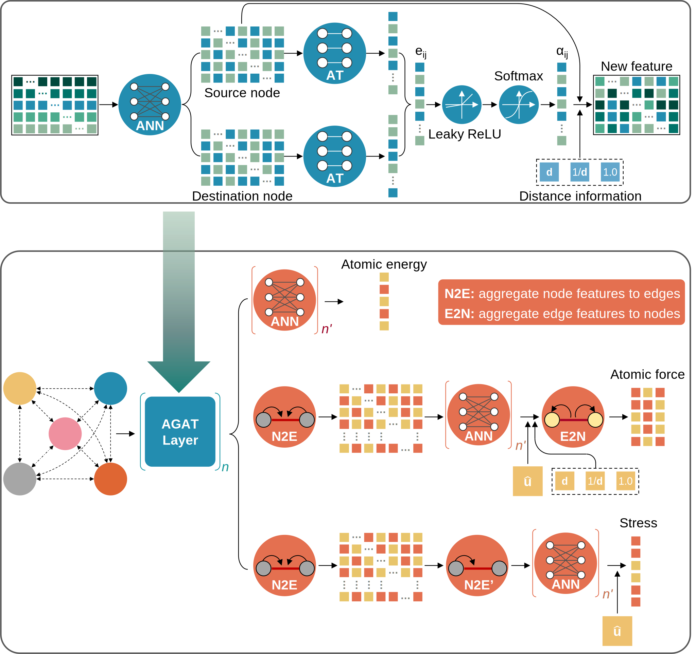
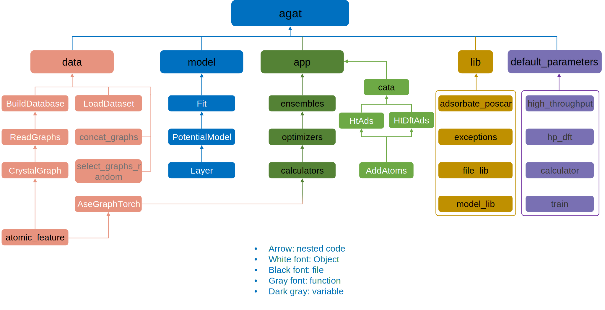

# AGAT (Atomic Graph ATtention networks)
[](https://github.com/jzhang-github/AGAT/blob/main/LICENSE)
[](https://pypi.org/project/agat/)
[](https://pypi.org/project/agat/)
[](https://pypi.org/project/agat/)

<!--
[](https://jzhang-github.github.io/AGAT/)
-->

  <br>  <br>  

# Using AGAT
The [documentation](https://jzhang-github.github.io/AGAT/) of AGAT API is available.

# Installation

### Install with [conda](https://conda.io/projects/conda/en/latest/user-guide/install/index.html) environment

- Download the [`agat_linux_gpu_cu124.yml`](agat_linux_gpu_cu124.yml) file.

- Run

  ```shell
  conda env create -f agat_linux_gpu_cu124.yml
  ```

  

- Install CUDA and CUDNN [**Optional**].
  
  - For HPC, you may load CUDA by checking `module av`, or you can contact your administrator for help.
  - [CUDA Toolkit](https://developer.nvidia.com/cuda-downloads)
  - [cuDNN](https://developer.nvidia.com/cudnn)


- [Customized installation](Customized installation.md)


# Quick start
### Prepare VASP calculations
Run VASP calculations at this step.

### Collect paths of VASP calculations
- We provided examples of VASP outputs at [VASP_calculations_example](https://github.com/jzhang-github/AGAT/tree/v1.0.0/files/VASP_calculations_example).   
- Find all directories containing `OUTCAR` file:   
  ```
  find . -name OUTCAR > paths.log
  ```
- Remove the string 'OUTCAR' in `paths.log`.   
  ```
  sed -i 's/OUTCAR$//g' paths.log
  ```
- Specify the absolute paths in `paths.log`.   
  ```
  sed -i "s#^.#${PWD}#g" paths.log
  ```

### Build database
```python
from agat.data import BuildDatabase
if __name__ == '__main__':
    database = BuildDatabase(mode_of_NN='ase_dist', num_of_cores=16)
    database.build()
```

### Train AGAT model
```python
from agat.model import Fit
f = Fit()
f.fit()
```

### Application (geometry optimization)
```python
from ase.optimize import BFGS
from agat.app import AgatCalculator
from ase.io import read
from ase import Atoms

model_save_dir = 'agat_model'
graph_build_scheme_dir = 'dataset'

atoms = read('POSCAR')
calculator=AgatCalculator(model_save_dir,
                          graph_build_scheme_dir)
atoms = Atoms(atoms, calculator=calculator)
dyn = BFGS(atoms, trajectory='test.traj')
dyn.run(fmax=0.05)
```
### Application (high-throughput prediction)
```python
from agat.app.cata import HpAds

model_save_dir = 'agat_model'
graph_build_scheme_dir = 'dataset'
formula='NiCoFePdPt'

ha = HpAds(model_save_dir=model_save_dir, graph_build_scheme_dir=graph_build_scheme_dir)
ha.run(formula=formula)
```

### For more custom manipulations, see our [documentation](https://jzhang-github.github.io/AGAT/) page.

<!--
[](https://jzhang-github.github.io/AGAT/)
-->


### Some default parameters
[agat/default_parameters.py](agat/default_parameters.py); Explanations: [docs/sphinx/source/Default parameters.md](https://github.com/jzhang-github/AGAT/blob/main/docs/sphinx/source/Default%20parameters.md).


# Package structure




# Change log  

Please check [Change_log.md](https://github.com/jzhang-github/AGAT/blob/main/Change_log.md)