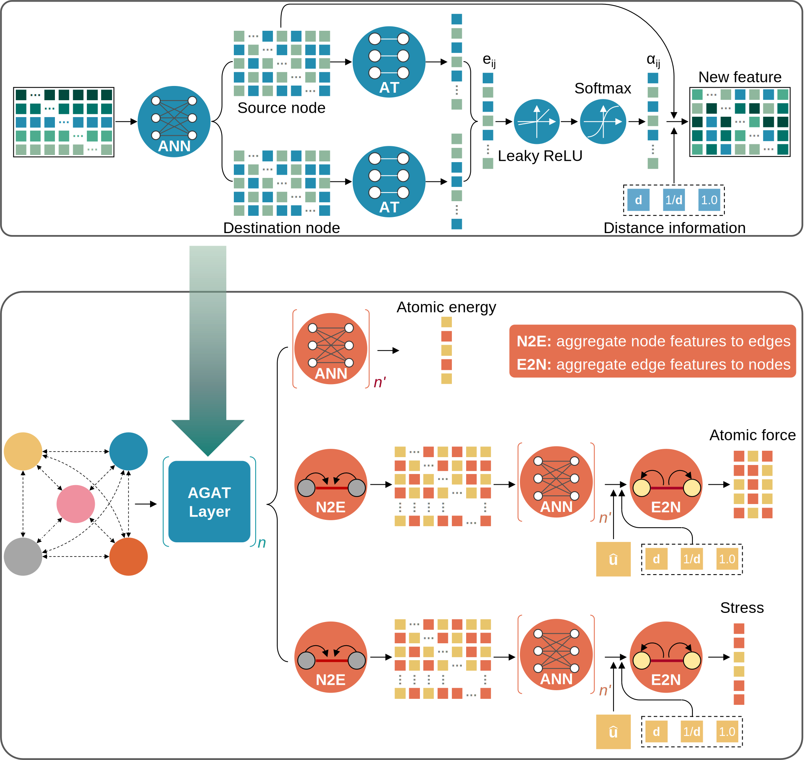

############
Introduction
############

=============================
Atomic Graph ATtention (AGAT)
=============================

AGAT model is an high-efficient deep-graph model for prediction energy, forces, and stress of crystals.

==================
API documentation
==================

   - :doc:`API doc <API_Docs>`.

===========
Source code
===========

   - Navigate to the `GitHub repo <https://github.com/jzhang-github/AGAT>`_.
   - For previous versions: Go to `GitHub branches <https://github.com/jzhang-github/AGAT/branches>`_.

